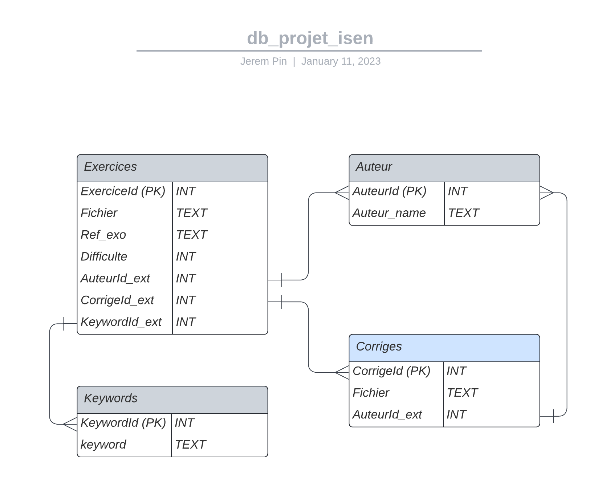

# ISEN_Projet
Projet d'informatique ISEN 2023

# Cahier des Charges

- Création du diagramme logique de la base de données : nous avons décidé de créer 4 tables (exercices, corrigés, mots- clefs, auteurs). Et dans chaque table nous avons mis les informations nécessaires correspondant aux exercices, auteur, corrigé, keywords. Cependant nous nous sommes aperçues que nous avons une cardinalité (n-n) entre les exercices et la table des mots-clefs. C’est pour cela que nous allons rajouter une table intermédiaire pour corriger ce problème.
- Création des différentes fonctions pour récupérer les données de la base de données à l'aide de la librairie sqlite3
- Trier les reponses de nos requetes
- Gestion des mots clefs 
- Générer un fichier .pdf à partir des exercies.Tex, pour cela nous avons créer une fonction qui fusionne les fichiers .Tex pour en faire que 1. Puis nous avons créé une fonction qui permet de convertir les fichiers .Tex en .Pdf 
- Interface Graphique (Pyside)
- Generation du Titre du poly (TD +  nom des themes)

# Code
- Fonction qui permet de récupérer les informations de la base de donées
- Fonctionne qui fussionne les fichers .Tex en un fichier 
- Fonction qui genere le PDF
- Fonction qui crée le GUI et qui permette d'interagir avec

# Diagramme logique de la base de donnée

