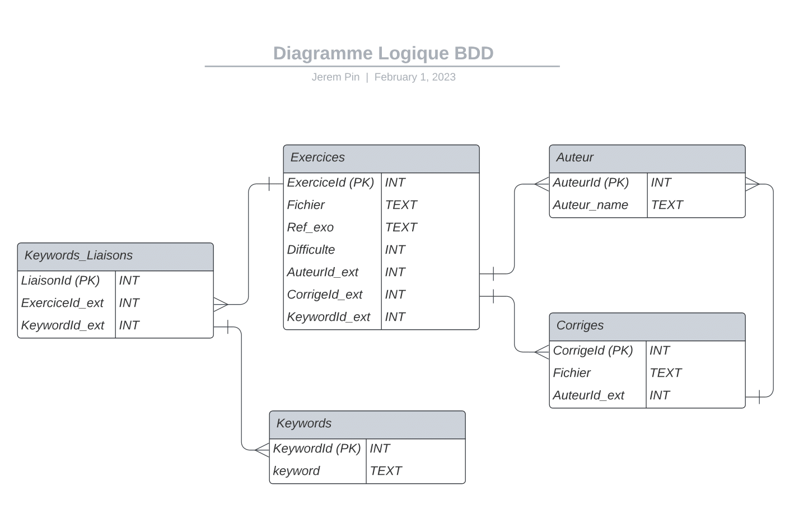

# Projet d'informatique ISEN 2023

## Cahier des Charges 
1. Création de la base de données ([cf diagramme logique ci-dessous](#Diagramme-logique-de-la-base-de-donnée)).
2. Création d'une classe qui permettent d'interagir avec notre base de données plus simplement en appelant les fonctions de la classe.
3. Création des fonctions pour chacun des besoins suivant : 
    - Fusionner plusieurs fichiers **.tex** ensemble
    - Convertir un fichier **.tex** en un fichier **.pdf**
    - Fonctions qui permettent d'interagir avec l'interface graphique
    - Générer un fichier **.pdf** à partir des exercices sélectionés
4. Création d'une interface graphique.<br/><br/>


## Logiciels utilisés
- Pour visualiser la base de données, on utilise le logiciel : [DB Browser For SQlite](https://sqlitebrowser.org/).
- Pour créer l'interface graphique, on utilise le logiciel : QT Designer.<br/><br/>


## Bibliothèque utilisées
- [Pyside 2](https://pypi.org/project/PySide2/) pour l'interface graphique.
- [SQLite 3](https://docs.python.org/3/library/sqlite3.html) pour interagir avec la base de données.<br/><br/>


## Liste des fonctions utilisées :
```python
class Database():

    def fetch(self, query: str) -> list:
        """
        Fonction permettant de récupérer des données dans une database donnée.

        :param query: requête SQL que l'on veut exécuter
        :return: renvoie les données récupérées grâce à cette requête
        """ 
        
    def edit(self, query: str):
        """
        Fonction permettant de modifier une database donnée (INSERT, DELETE, CHANGE).

        :param query: requête SQL que l'on veut exécuter
        """ 
        
    def connect(self) -> bool:
        """
        Fonction permettant de se connecter à la database donnée.

        :return: renvoie un booléen True si nous sommes connecté, False sinon
        """ 
```
```python
def fusionner_fichier_tex(fichiers_path: list,  nom_du_fichier_final: str):
    """
    Fonction permettant de fusionner plusieurs fichiers .tex en un seul, elle crée un fichiers .tex comprenant l'esemble des fichiers fusionné

    :param fichiers_path: liste des chemins d'accès aux fichier .tex que l'on veut fusionner
    :param nom_du_fichier_final: nom du fichier final, fichier comportant la fusion de tous les fichiers .tex 
    """ 
```
```python
def tex_to_pdf(file_name: str):
    """
    Fonction permettant de créer un fichier .pdf à partir d'un fichier .tex

    :param file_name: nom du fichier .tex que l'on veut convertir en .pdf
    """ 
```
```python
    def generate(self):
        """
        Fonction permettant de generer un fichier pdf comportant tous les exercices compris dans le tableau de l'interface
        à l'aide des deux fonctions fusionner_fichier_tex() et tex_to_pdf()
        """
```
*Plus les fonctions qui permettent d'interagir avec l'interface graphique*<br/><br/>


## Diagramme logique de la base de donnée

