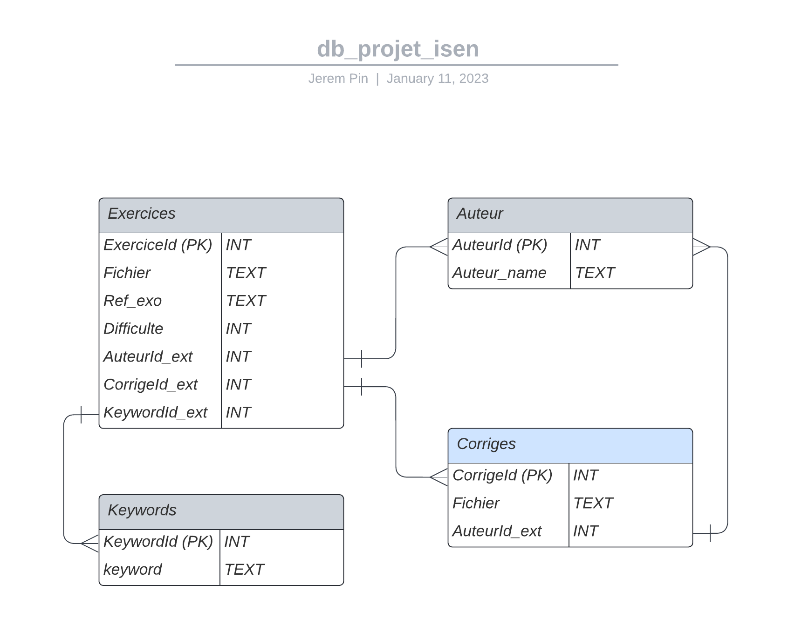

# ISEN_Projet
Projet d'informatique ISEN 2023  

# Cahier des Charges

- Créer la base de donnée
- Faire des requêtes sur la base de donnée
- Trier les reponses de nos requetes
- Generer un fichier .pdf a patrtir de nos exos
- Interface Graphique (Pyside, Tkinter)
- Generation du Titre du poly

# Libraries à utilisées:
- mysql-connector-python
- TKinter
- Pyside
- DB Browser (logiciel)

# Code
- Créer des fonctions qui permettent de recuperer, supprimer, ajouter, modifier un exercice
- Fonction qui genere le PDF
- Fonction qui crée le GUI et qui permette d'interagir avec

# Diagramme logique de la base de donnée

